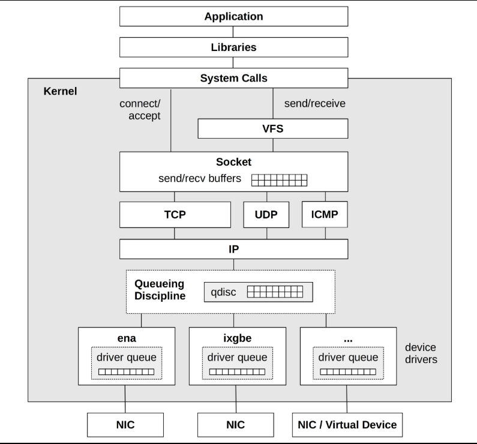
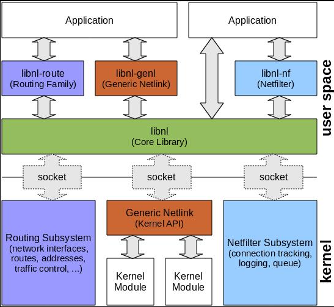
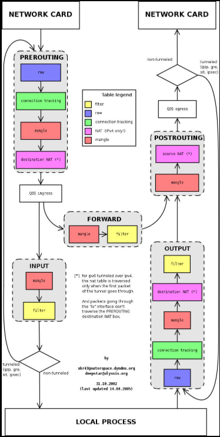
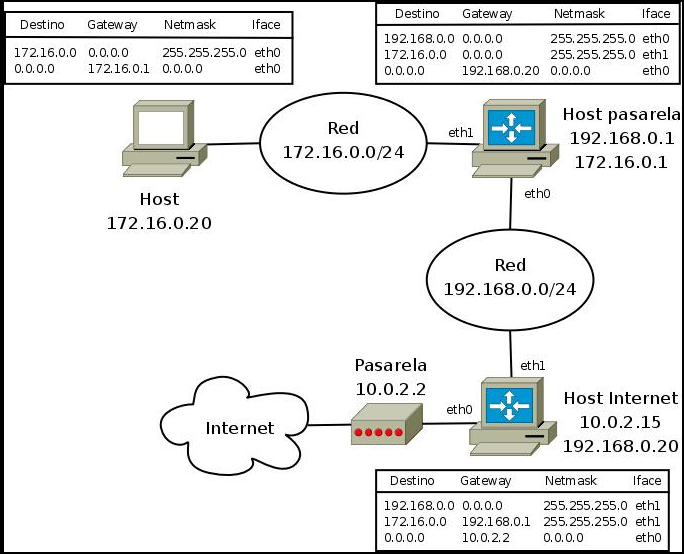
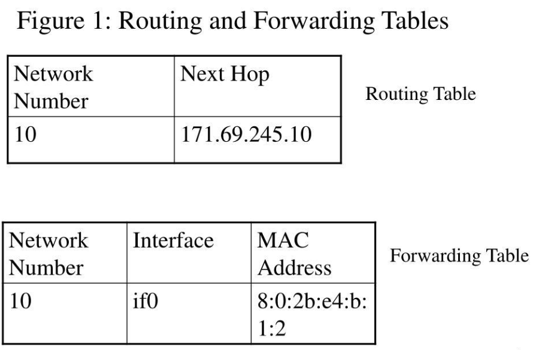
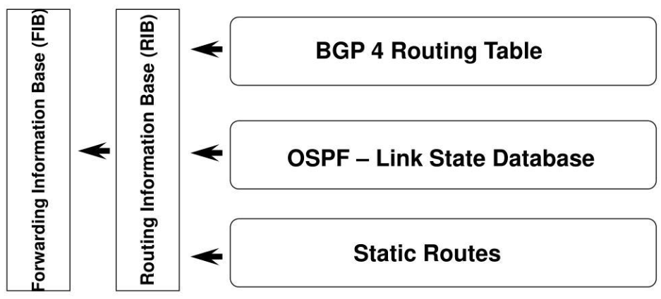
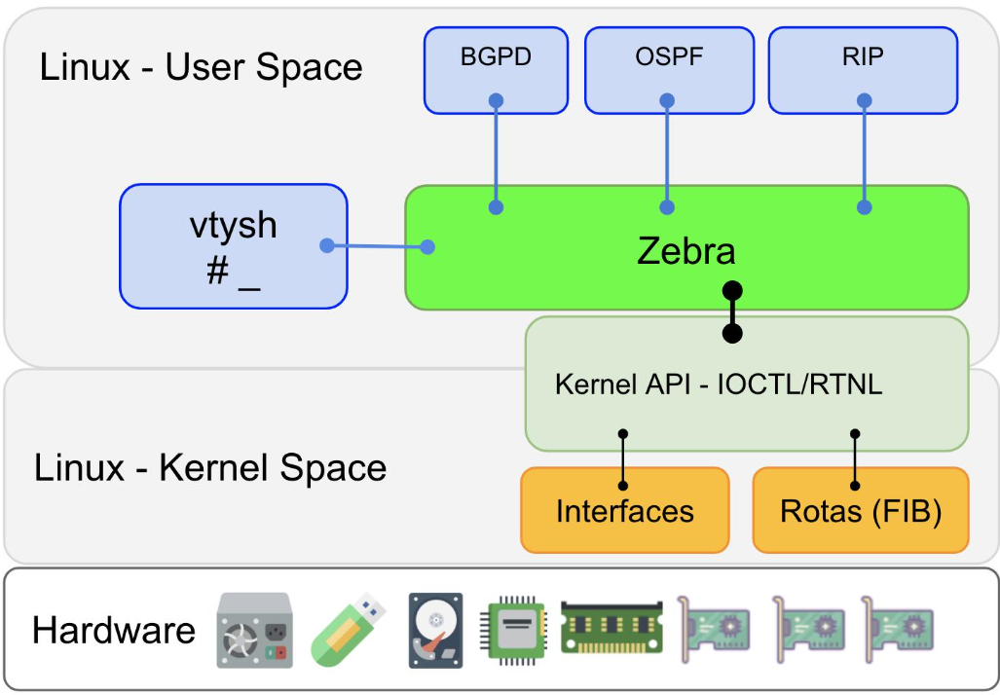
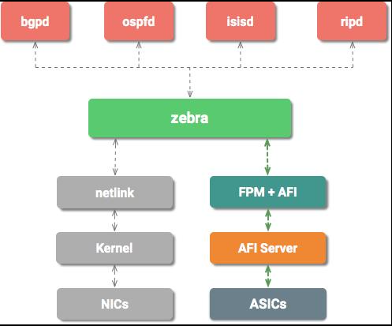

# Networking Basics — Key Terms for BADASS

---

## Quick Reference

| Term | One-line meaning | Analogy |
|---|---|---|
| **Alpine / BusyBox** | Minimal Linux OS + single binary with 300 Unix tools | Studio apartment + Swiss Army knife |
| **Linux kernel networking stack** | The layers packets travel through from app to NIC | Post office pipeline |
| **Netlink / libnl** | Kernel API to configure networking from user space | Dedicated hotline to the kernel |
| **iptables / netfilter** | Kernel hooks that filter/modify packets at 5 checkpoints | Airport security gates |
| **Network topology** | How devices are arranged and connected | Road map |
| **Routing Table vs Forwarding Table** | Control plane knowledge vs data plane fast lookup | GPS map vs turn-by-turn directions |
| **RIB / FIB** | All known routes vs the best routes programmed into kernel | All flights vs the one you booked |
| **FRR architecture** | Routing daemon suite — each protocol talks to zebra, zebra owns the kernel table | Airlines filing flight plans with an air traffic controller |

---

## Alpine / BusyBox

| | |
|---|---|
| **Alpine Linux** | Minimal Linux distro (~5 MB) built on musl libc and BusyBox — used as the base for Docker containers in this project |
| **BusyBox** | Single binary that bundles ~300 Unix commands (`sh`, `ls`, `ping`, `ip`, etc.) — replaces an entire toolbox in a tiny footprint |
| **Why it matters** | Alpine is the base image for both host and router containers; its small size keeps builds fast and attack surface minimal |
| **Analogy** | Alpine = studio apartment (small, everything you need). BusyBox = Swiss Army knife (one tool, many blades) |
| **Learn more** | [Alpine Linux](https://alpinelinux.org/) · [BusyBox](https://busybox.net/) · [Alpine Docker Hub](https://hub.docker.com/_/alpine) |

---

## Linux Kernel Networking Stack

| | |
|---|---|
| **What it is** | The layers a packet travels through from an application down to the network card (and back up on receipt) |
| **Layers** | Application → Libraries → System Calls → Socket (send/recv buffers) → TCP/UDP/ICMP → IP → Queueing Discipline → NIC driver → Hardware |
| **Key insight** | Every `send()` call from your app eventually becomes raw bytes on a wire — the kernel handles all the framing, addressing, and queuing in between |
| **Analogy** | Like a post office pipeline: you write a letter (app), put it in an envelope with a destination address (socket/IP), drop it at the counter (system call), and the post office routes and delivers it (kernel → NIC) |
| **Learn more** | [Linux Kernel Networking Docs](https://www.kernel.org/doc/html/latest/networking/) · [Illustrated guide to network stack](https://www.privateinternetaccess.com/blog/linux-networking-stack-from-the-ground-up-part-1/) |

---

## Netlink / libnl

| | |
|---|---|
| **Netlink** | Socket-based IPC mechanism between user space and the Linux kernel — used to add/delete routes, configure interfaces, manage ARP tables, etc. |
| **libnl** | C library that wraps Netlink sockets with a friendlier API — used by tools like `ip` (iproute2) and FRR's `zebra` |
| **Who uses it** | `zebra` calls Netlink to program routes into the kernel FIB; `ip route add` does the same thing |
| **Analogy** | Like a dedicated phone line between your program and the kernel — instead of a raw system call, you send structured messages back and forth |
| **Learn more** | [libnl project](https://www.infradead.org/~tgr/libnl/) · [Netlink — kernel docs](https://www.kernel.org/doc/html/latest/userspace-api/netlink/intro.html) |

---

## iptables / netfilter

| | |
|---|---|
| **netfilter** | Framework built into the Linux kernel with 5 hooks in the packet path where rules can inspect, modify, accept, or drop packets |
| **iptables** | User-space tool that writes rules into netfilter's tables |
| **5 hooks** | `PREROUTING` → `INPUT` (local) / `FORWARD` (routed) → `OUTPUT` → `POSTROUTING` |
| **Tables** | `filter` (allow/drop), `nat` (address translation), `mangle` (modify headers), `raw` (connection tracking bypass) |
| **Analogy** | Like airport security checkpoints — every packet passes through gates where it can be inspected, redirected, or rejected before reaching its destination |
| **Learn more** | [netfilter.org](https://netfilter.org/) · [iptables tutorial](https://www.frozentux.net/iptables-tutorial/iptables-tutorial.html) · [Netfilter hooks — kernel docs](https://www.netfilter.org/documentation/HOWTO/netfilter-hacking-HOWTO-3.html) |

---

## Network Topology

| | |
|---|---|
| **What it is** | The physical and logical arrangement of nodes (hosts, routers, switches) and the links between them |
| **Routing table** | Each router stores a table mapping destination networks → next-hop gateway + interface; packets are forwarded hop-by-hop using these tables |
| **In GNS3** | You draw the topology on a canvas — each link becomes a virtual wire; each node runs in its own network namespace |
| **Analogy** | A road map: shows all roads (links), cities (nodes), and which highway to take to reach each destination (routing table entries) |
| **Learn more** | [How routing works](https://www.cloudflare.com/learning/network-layer/what-is-a-router/) · [iproute2 `ip route`](https://man7.org/linux/man-pages/man8/ip-route.8.html) |

---

## Routing Table vs Forwarding Table

| | Routing Table | Forwarding Table |
|---|---|---|
| **Also called** | RIB (Routing Information Base) | FIB (Forwarding Information Base) |
| **Plane** | Control plane | Data plane |
| **Contents** | All known routes with metrics, admin distance, protocol source | Best selected routes optimized for fast lookup |
| **Used by** | Routing daemons (bgpd, ospfd) to exchange and compare routes | Kernel / hardware to forward each arriving packet |
| **Speed** | Slower — updated when topology changes | Faster — queried for every single packet |
| **Analogy** | GPS map with all available roads and traffic data | Turn-by-turn directions for the route you chose |

**Learn more:** [RIB vs FIB explained](https://networklessons.com/cisco/ccnp-encor/rib-fib/) · [Cisco — routing and forwarding](https://www.cisco.com/c/en/us/td/docs/ios-xml/ios/iproute_pi/configuration/xe-16/iri-xe-16-book/iri-overview.html)

---

## RIB / FIB

| | |
|---|---|
| **RIB** | Routing Information Base — collects routes from all active protocols (BGP, OSPF, IS-IS, static). Multiple routes to the same destination may exist |
| **FIB** | Forwarding Information Base — the winner: one best route per destination, programmed into the kernel via Netlink for actual packet forwarding |
| **Who manages it** | In FRR: `zebra` collects from all daemons into the RIB, selects the best route (by admin distance + metric), and installs it into the FIB via Netlink |
| **Analogy** | RIB = all available flights to your destination. FIB = the one flight you actually booked and are on |
| **Learn more** | [RIB/FIB — NetworkLessons](https://networklessons.com/cisco/ccnp-encor/rib-fib/) · [FRR zebra docs](https://docs.frrouting.org/en/latest/zebra.html) |

---

## FRR Architecture

| | |
|---|---|
| **FRR** | Free Range Routing — open-source routing protocol suite for Linux, successor to Quagga |
| **Design** | Each routing protocol runs as a separate daemon; all share a common interface through `zebra` |
| **`zebra`** | The central daemon — owns the RIB, programs the FIB via Netlink, manages interfaces. All other daemons connect to it via a Unix socket |
| **`vtysh`** | Unified CLI shell that connects to all running daemons at once — like a single cockpit for the whole routing stack |
| **Daemons in use** | `bgpd` (BGP), `ospfd` (OSPF), `isisd` (IS-IS), `staticd` (static routes) |
| **Analogy** | Zebra = air traffic controller. bgpd/ospfd/isisd = airlines. Each airline files a flight plan (route); the controller decides what goes on the runway (FIB) |
| **Learn more** | [FRR official docs](https://docs.frrouting.org/) · [FRR GitHub](https://github.com/FRRouting/frr) · [FRR zebra](https://docs.frrouting.org/en/latest/zebra.html) |

**User space view — zebra bridging daemons and kernel:**

**Full daemon stack — bgpd, ospfd, isisd → zebra → netlink → kernel/NICs:**

